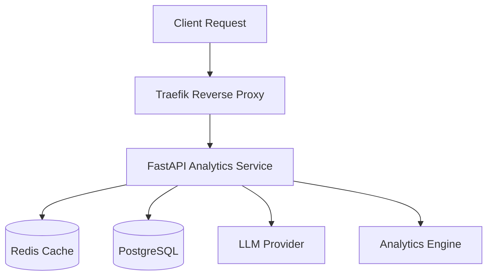

# Architecture

## Service Boundaries

## Request Lifecycle
1. User submits a natural-language query to `/query`.
2. System checks Redis cache for an exact match mapped to the `dataset_version`.
3. If miss, the LLM Provider creates a deterministic `Query Plan`.
4. The `Analytics Engine` reads the plan and executes operations against `NormalizedRecord` in PostgreSQL using `Decimal` arithmetic.
5. `DisagreementMetadata` and `Citation` records are fetched based on the lineage.
6. A response is formatted, cached in Redis, and returned.

## Ingestion Pipeline
CSVs are parsed by the `Ingestion Service`. If discrepancies are found between sources (e.g., source A vs source B for a stock price on the same date), a `ReconciliationDecision` is generated and a unified `NormalizedRecord` is created.
