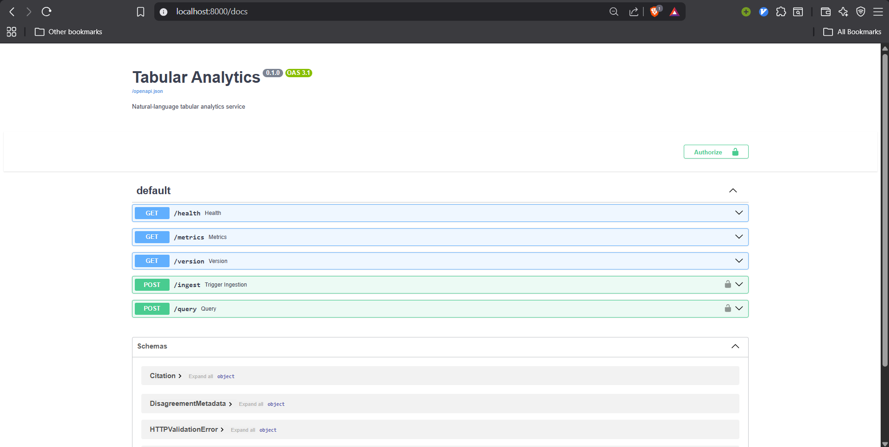
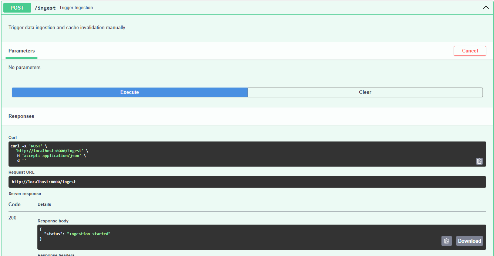
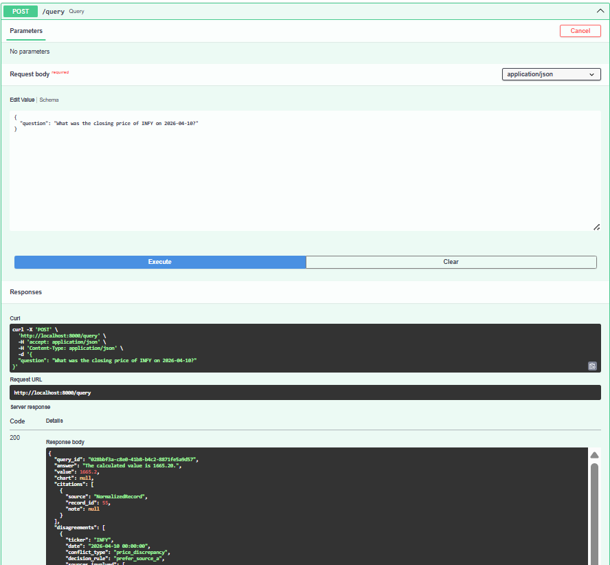

# Local Development

## Prerequisites
- Python 3.11+
- `uv` (fast Python package installer)
- Docker & Docker Compose
- `make`

## Setup Instructions

1. **Install Dependencies**
   ```bash
   uv pip install --system -r app/pyproject.toml[dev]
   ```

2. **Run Local Infrastructure**
   Spin up the local services (Postgres, Redis, API, Observability stack):
   ```bash
   make run
   ```




3. **Run Tests**
   Execute the test suite:
   ```bash
   make test
   ```

4. **Serve Documentation**
   Preview documentation changes locally:
   ```bash
   make docs-serve
   ```

## API Access
- The API is available at `http://localhost:8000`.
- The Traefik dashboard is accessible if enabled.
- Prometheus and Grafana run on ports `9090` and `3000` respectively.
