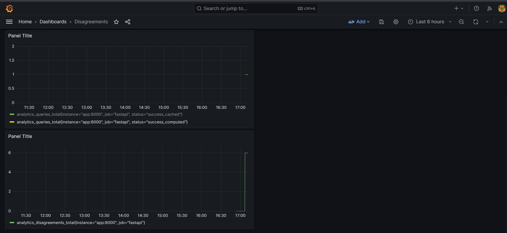

## Observability

### Tracing

We use **OpenTelemetry** for distributed tracing across the application stack.

Instrumented components include:

* FastAPI request lifecycle
* SQLAlchemy database operations
* Redis cache interactions

Each API response includes a `trace_id` to simplify debugging and request correlation across services.

---

## Metrics

The FastAPI application exposes a `/metrics` endpoint which is scraped by **Prometheus**.

Implemented metrics include:

* `analytics_queries_total`

  * Counter tracking total analytics queries.
  * Labeled by query execution status.

* `analytics_query_latency_seconds`

  * Histogram measuring end-to-end query execution latency.

* `analytics_disagreements_total`

  * Counter tracking data reconciliation conflicts detected during ingestion.

* `analytics_cache_hits_total`

  * Counter tracking successful cache hits from Redis.

These metrics are visualized in Grafana dashboards for operational monitoring and debugging.

---

## Logging

Structured JSON logging is implemented using **structlog**.

Each log event contains:

* timestamp
* log level
* logger name
* contextual metadata

Additional contextual fields include:

* `query_id`
* `trace_id`
* `ticker`
* reconciliation source metadata

Example events:

* query execution success/failure
* ingestion pipeline progress
* reconciliation disagreements
* cache interactions
* health check failures

---

## Dashboards

**Grafana** is used for real-time observability dashboards.

Dashboards visualize:

* total query throughput
* request latency
* disagreement frequency
* cache hit statistics
* service health

---

## Monitoring Stack

The observability stack consists of:

* Prometheus for metrics collection
* Grafana for dashboards
* OpenTelemetry for tracing
* Redis instrumentation for cache monitoring
* SQLAlchemy instrumentation for DB tracing
